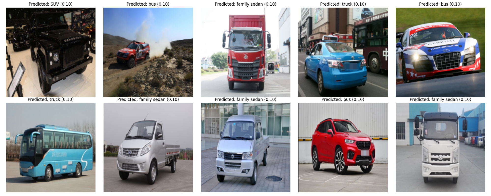
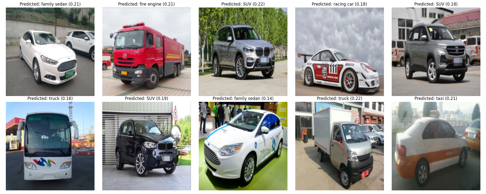

# RBE577_MachineLearning_Robotics

---

## Sample Project Image


---

## HW1

**Implemented the algorithms and data studied in the paper:**
> "Constrained control allocation for dynamic ship positioning using deep neural network"

### Setup
1. Create a virtual environment with Python 3.10.12:
    ```bash
    python3 -m venv .venv
    source ./.venv/bin/activate
    pip install -r requirements.txt
    ```

### Running Training
Run:
```bash
python hw1/src/main.py
```

---

## HW2

### Features
- Train and fine-tune ResNet152 on your dataset
- Early stopping and best model saving
- TensorBoard logging for loss and accuracy
- Inference on raw test images (no ground truth required)
- Individual prediction images and a grid summary with prediction probabilities

### Setup
Install requirements:
```bash
pip install -r hw2/requirements.txt
```

### Download Data
Change to the data directory, set permissions, and execute the script:
```bash
cd hw2/src/data
sudo chmod 777 ./download_data.sh
./download_data.sh
```

### Run Options
**Fine-tune last layer:**
```bash
python hw2/src/hw2_main.py --mode finetune --epochs 5 --patience 3 --save_path best_finetune_model.pth
```

**Train entire model:**
```bash
python hw2/src/hw2_main.py --mode train --epochs 5 --patience 3 --save_path best_train_model.pth
```

**Test and save predictions:**
```bash
python hw2/src/hw2_main.py --mode test --num_images 10 --save_path best_finetune_model.pth
```

- `--mode`: Select 'finetune', 'train', or 'test'.
- `--epochs`: Number of epochs for training (default: 5).
- `--patience`: Early stopping patience (default: 3).
- `--save_path`: Path to save/load best model weights.
- `--num_images`: Number of test images to evaluate and save plots for (default: 10).

### Output
- Individual prediction images: `hw2/test_predictions/`
- Grid summary of predictions: `hw2/docs/test_predictions_grid_current.png` (current weights), `hw2/docs/test_predictions_grid_best.png` (best weights)
- Each prediction includes the probability/confidence

### TensorBoard
To visualize training progress:
```bash
tensorboard --logdir runs
```

### Results

**Without Fine-Tuning or Full Training Predictions:**



**Best Model Predictions:**



### Notes
- Place your training, validation, and test images in:
  - `hw2/src/data/train/`
  - `hw2/src/data/val/`
  - `hw2/src/data/test/`
- Test images do not require ground truth labels or subfolders.
- The `.gitignore` excludes image outputs and prediction folders.

---